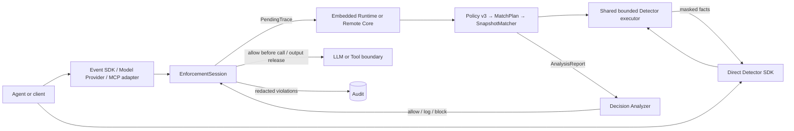

# Agent Guardrail

**An explainable policy analyzer and enforcement gateway for AI agents.**

English | [简体中文](README.zh-CN.md)

[](pyproject.toml)
[](pyproject.toml)
[](docs/roadmap.md)
[](LICENSE)

Agent Guardrail can run bounded Detectors directly without YAML, or compile a strict YAML policy
into an immutable match plan for cross-event decisions. Applications can use both modes through
framework-neutral SDKs; Gateways additionally enforce decisions at concrete model and tool
execution checkpoints.

The project focuses on three assets: **user data, user intent, and user resources**. Detector hits
are evidence, not security decisions by themselves; policies combine those facts with trusted
source, destination, and authorization context.

> **Project status — v0.1.0 alpha.** The direct Detector SDK, event/Policy SDK, core runtime, Inline
> wrappers, provider-neutral Adapter contract, OpenAI Chat/Responses streaming Gateway, stateless
> MCP Gateway, and remote Core path are implemented and tested. The application is explicitly
> single-user; it is not a sandbox or persistent-session service and does not model users, tenants,
> or data ownership.

## Why Agent Guardrail?

- **Analysis plus enforceable boundaries.** SDK users choose where decisions apply; Gateway blocks
  before model/tool calls and before model/tool outputs are released.
- **One auditable policy chain.** Strict `version: 3` YAML becomes `MatchPlan → AnalysisReport →
  Decision`; there is no second production interpreter.
- **No executable policy payloads.** YAML cannot import Python, register callbacks, select files,
  choose network endpoints, or acquire arbitrary I/O permissions.
- **Typed traces and explicit relations.** Messages, model calls, tool proposals, actual tool calls,
  and tool results are immutable events. Temporal order is never silently treated as provenance.
- **Deployment-owned capabilities.** Models, rulesets, processes, and credentials are selected by
  the deployment, while Policy sees only reviewed capability names and bounded parameters.
- **Redacted by construction.** Findings, violations, errors, and optional audit records contain
  structured, masked evidence instead of raw secrets, PII, or prompts.

## Architecture



Policies describe semantic events and relations, independently of enforcement placement. Gateway
adapters map provider traffic into those events and use four execution checkpoints:

```text
before_model_call → LLM → before_model_output_release
before_tool_call  → Tool → before_tool_output_release
```

Analysis always sees the committed trace plus the complete pending event batch. Allow and log
decisions atomically commit that batch; block discards the raw pending events and commits only a
sanitized decision event.

## Quick start

Requirements: Python 3.12 or later and [uv](https://docs.astral.sh/uv/).

```bash
git clone https://github.com/cipeizheng/agent-guardrail.git
cd agent-guardrail
uv sync --frozen --extra gateway --dev
uv run python examples/secret_email_demo.py
```

The demo uses a deterministic fake model and tool, so it needs no API key. The important output is:

```text
blocked before tool execution
llm executions: 1
send_email executions: 0
```

The model proposed a tool call containing a secret, but the guarded email tool was never executed.

## A policy is data, not code

This policy blocks a `send_email` tool call when its arguments contain secret material:

```yaml
version: 3

engine:
  on_analysis_error: block
  on_detector_timeout: block

scopes: [pending]

rules:
  - id: prevent-secret-email
    action: block
    events:
      call:
        kind: tool_call_proposal
        domain: pending
    where:
      all:
        - tool: {binding: call, name: send_email}
        - detector:
            id: secret_scan
            capability: secrets
            inputs:
              - value: {field: [call, payload, arguments]}
                encoding: canonical_json
    finding:
      code: secret_exfiltration
      message: The tool call contains secret material.
      subjects: [call]
      evidence: [{source: detector, id: secret_scan}]
```

The loader rejects duplicate keys, unknown fields, loose types, YAML aliases/tags, invalid
references, and unavailable capabilities before a runtime is activated. See the
[Policy authoring guide](docs/guides/policy-authoring.md) for bindings, relations, quantifiers,
derived values, findings, budgets, and trusted security parameters.

## Integration options

| Integration | Best fit | Current guarantee |
| --- | --- | --- |
| Direct Detector SDK | Any Python code needs a fact at an arbitrary insertion point | No YAML; bounded text/JSON/batch detection, with application-owned action |
| Event/Policy SDK | Any Python agent/framework can expose semantic events | No framework adapter required; the application carries explicit `EventRef` relations and can bind trusted source facts to exact Events |
| Inline wrappers | You can inject LLM and tool interfaces | Mediates calls passing through the shared task-level session |
| Model Provider Gateway | OpenAI Chat/Responses or a deployment adapter | Full request checks; atomic non-streaming output checks; non-retractable prefix-guarded SSE |
| MCP Gateway | Tools are exposed by a fixed MCP server | Checks every stateless `tools/call` before and after execution |
| Remote Core | Policy and detector assets must be isolated from the edge | Gateway owns traffic and side effects; Core analyzes complete `PendingTrace` values |
| Docker Compose | Self-hosted Core + Gateway | Read-only containers, private Core network, separated provider and Core credentials |

Direct detection requires no Policy file:

```python
from agent_guardrail import DetectorRunner

detectors = DetectorRunner.from_profile("local")
result = await detectors.detect("prompt_injection", retrieved_text)
if result.detected:
    reject_untrusted_content()
```

This returns masked facts, not an allow/block Decision. `detect_text`, `detect_json`, and
`detect_many` share exactly the same descriptor, timeout, result-limit, and redaction boundary as
YAML/MatchPlan Detector conditions. Backend errors raise a redacted `DetectorExecutionError`
instead of silently becoming “no hit.”

For an OpenAI client, the agent only changes its base URL:

```python
from openai import OpenAI

client = OpenAI(
    api_key="gateway-key",
    base_url="http://127.0.0.1:8080/v1/openai",
)
```

Both `client.chat.completions.create(...)` and `client.responses.create(...)` support
`stream=False/True`. Streaming releases only policy-checked cumulative text prefixes and fully
validated tool arguments; a later block cannot retract an earlier released prefix. Use
`stream=False` when complete-output atomicity is required. Trusted deployments can register a
non-OpenAI wire adapter at `/v1/providers/...`; client requests still cannot select an upstream
URL.

For MCP Python SDK v2:

```python
from mcp import Client

async with Client("http://127.0.0.1:8080/v1/mcp", cache=None) as client:
    result = await client.call_tool("send_email", {"to": "outside@example.com"})
```

See the [integration guide](docs/guides/integration.md) and
[Gateway protocol reference](docs/reference/gateway-protocol.md) for lifecycle and protocol
details.

## Capabilities

The default `local` registry performs no model downloads and publishes:

- Detectors: `secrets`, `pii`, `prompt_injection`, `unicode_security`,
  `python_ast_ipython`, and `hidden_content`.
- Pure predicates: `number_in_range`, `length_in_range`, `url_host_allowed`, and
  `fuzzy_contains`.

Deployment-fixed optional capabilities are deliberately separate:

| Availability | Capability | Backend boundary |
| --- | --- | --- |
| `full_local_v1` | `prompt_injection_model` | Pinned Protect AI DeBERTa checkpoint, local CPU/CUDA inference |
| `full_local_promptguard2` / `promptguard2_only` | `prompt_injection_model` | Pinned Meta PromptGuard 2 86M (Llama 4 Community License, opt-in candidate) |
| `full_local_v1` / `full_local_promptguard2` | enhanced `pii` | Pinned Presidio/spaCy English NER plus local validators |
| `full_local_v1` / `full_local_promptguard2` | `semgrep` | Isolated, version-pinned CLI and bundled Python ruleset |
| `full_local_v1` / `full_local_promptguard2` | `yara_injection_signatures` | Pinned yara-python, bundled ruleset, and fixed rule-to-type mapping |
| Explicit injection | `is_similar` | Deployment-selected `EmbeddingProfile` and async embedding backend |
| Explicit injection | `prompt_injection_judge` | Deployment-selected `LLMJudgeBackend`/`LLMJudgeProfile` verdict channel |

The real `prompt_injection_model` backend is currently a `baseline`, not a complete defense: the
locked public BIPIA/NotInject evaluation exposes low attack recall and substantial over-defense.
`is_similar` and `prompt_injection_judge` remain `adapter_only` because no external
embedding or judge service has been accepted as verified. The exact, non-marketing status of every capability lives in the
[capability matrix](docs/capability-status.yaml); the reproducible Detector evaluation lives under
[`evals/prompt_injection`](evals/prompt_injection/README.md). The isolated
[`evals/agentdojo`](evals/agentdojo/README.md) pilot separately measures real-Agent utility and
targeted ASR; an Adapter smoke does not count as a completed real-model result.

## Deployment profiles

### Default local profile

The default profile is lightweight and deterministic. It does not load Transformers, Presidio,
Semgrep, YARA, or a remote embedding client.

### Full local profile

`full_local_v1` pins and verifies its detector dependencies and model assets before startup:

```bash
uv sync --frozen --extra gateway --extra detectors --no-dev
uv tool install semgrep==1.170.0
export AGENT_GUARDRAIL_DETECTOR_ASSETS_DIR=/var/lib/agent-guardrail/detectors
uv run agent-guardrail-prefetch-detectors
export AGENT_GUARDRAIL_DETECTOR_PROFILE=full_local_v1
```

Runtime startup fails if required assets, versions, checksums, or the selected CUDA device do not
match the profile. Policy YAML still cannot replace those choices.

### PromptGuard 2 candidate profiles

`full_local_promptguard2` swaps the prompt-injection classifier for Meta PromptGuard 2 86M
(same full stack otherwise); `promptguard2_only` loads the local heuristic stack plus only
PromptGuard 2. Both are opt-in candidates under the Llama 4 Community License and never the
default deployment; their default threshold is 0.9 and their assets are fetched with
`uv run agent-guardrail-prefetch-promptguard2`. See the
[operations guide](docs/guides/operations.md) for details and license notes.

Beyond presets, detector stacks can be composed per component
(`AGENT_GUARDRAIL_DETECTOR_PII/_SEMGREP/_YARA/_PROMPT_MODEL`); presets and component variables
are mutually exclusive. Each component is individually validated; untested combinations are the
deployer's responsibility.

### Docker Compose

```bash
cp .env.example .env
# Replace every placeholder in .env.
docker compose build
docker compose up -d
curl --fail http://127.0.0.1:8080/health/ready
```

The Core image includes the full detector profile and is intentionally large. Read the
[operations guide](docs/guides/operations.md) before using it outside a local environment.

## Current boundaries

Agent Guardrail only mediates traffic that passes through its wrappers or gateways. It does not
currently provide:

- cross-request session state or policy hot reload;
- a sandbox or interception for direct shell, function, filesystem, or arbitrary HTTP access;
- a web management UI or distributed policy service;
- moderation, copyright, or OCR capabilities.

Multi-user identity, tenant isolation, cross-user sharing, and per-user authorization are outside
the product scope rather than deferred features.

If an agent can execute shell commands or arbitrary code, deploy it in a separate sandbox with
default-deny network egress, ephemeral/minimal filesystem access, resource limits, and no
provider or tool credentials. Keep the Guardrail Gateway, Policy/Core, credentialed tool brokers,
and audit outside that sandbox. Pattern, code, and URL detectors cannot stop an unobserved
`curl`, socket, syscall, credential read, persistence attempt, resource-exhaustion attack, or
sandbox escape. See the [threat boundary matrix](docs/security-model.md#8-guardrail-无法替代的-sandbox-控制)
and [deployment checklist](docs/guides/operations.md#3-agent-sandbox-与不可绕过部署边界).

A detector hit is not proof of malicious intent or authorization. Production
rules should combine detector facts with trusted source/sink context. The authoritative boundaries
are maintained in the [current architecture contract](docs/current-architecture-contract.md) and
[security model](docs/security-model.md).

## Documentation

| Read this | When you need to... |
| --- | --- |
| [Documentation map](docs/README.md) | Choose the shortest reading path for a task |
| [Architecture overview](docs/overview.md) | Understand Event, MatchPlan, Runtime, and Enforcement |
| [Policy authoring](docs/guides/policy-authoring.md) | Write strict production YAML policies |
| [Capability reference](docs/reference/capabilities.md) | Use detectors, predicates, and optional backends |
| [Integration guide](docs/guides/integration.md) | Connect an Agent, OpenAI client, or MCP client |
| [Operations guide](docs/guides/operations.md) | Configure secrets, profiles, Docker, audit, and health |
| [Security model](docs/security-model.md) | Review assets, trust boundaries, and T01–T10 |
| [Roadmap](docs/roadmap.md) | See planned work without confusing it with shipped behavior |

## Development

```bash
uv sync --frozen --extra gateway --dev
uv run pytest --cov=agent_guardrail --cov-report=term-missing
uv run ruff check .
uv run pyright
uv build
git diff --check
```

Contributions are welcome. Start with [CONTRIBUTING.md](CONTRIBUTING.md); architecture and safety
changes must preserve the contracts documented in the repository.

## License

Agent Guardrail is available under the [MIT License](LICENSE). Optional detector components
pulled in by the model profiles keep their own upstream licenses -- notably PromptGuard 2
weights (Llama 4 Community License, requires "Built with Llama" attribution when
redistributed) -- and are never bundled in this repository.
