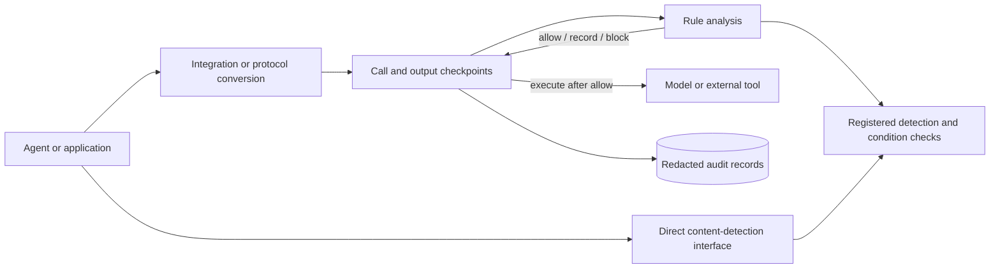

# Agent Guardrail

**An explainable safety-rule analysis and execution-control framework for AI agents.**

English | [简体中文](README.zh-CN.md)

[](pyproject.toml)
[](pyproject.toml)
[](docs/roadmap.md)
[](LICENSE)

Deployers connect content-detection components and write safety rules. Agent Guardrail reads the
messages, model calls, tool calls, and tool results produced while an agent runs. It applies those
rules to allow, record, or block an operation before a model or tool runs and before output reaches
the agent.

The framework guarantees consistent rule loading and enforcement. Detection accuracy depends on
the selected detection component; security and utility outcomes depend on the application's rule
set and workload.

> **Project status — v0.1.0 alpha.** The programmatic detection and rule interfaces, model proxy,
> tool proxy using MCP (a standard protocol for agent tools), streaming-output checks, in-memory
> records for one task, and separately deployed rule-analysis service are implemented and tested.
> The deployment model serves one user. Host infrastructure supplies process isolation, durable
> state, identity, and resource limits.

## What Agent Guardrail provides

- **Analysis and enforcement boundaries.** Applications can call rule analysis directly; proxies
  can block before model or tool calls and before output release.
- **One rule-execution path.** Strict YAML configuration becomes one immutable internal plan. The
  same path produces every allow, record, and block result.
- **Data-only rule configuration.** YAML selects detection and condition checks registered by the
  deployer. Deployment code owns implementations, files, processes, endpoints, and permissions.
- **Structured execution records.** Messages, model calls, proposed tool calls, actual tool calls,
  and tool results are immutable records. Explicit links show how an earlier record produced or
  influenced a later operation; timestamps describe ordering.
- **Deployer-selected detection.** The deployer configures models, rulesets, external processes,
  and credentials. Safety rules use registered names and bounded parameters.
- **Redacted evidence.** Matches, violations, errors, and audit records contain structured,
  masked information.

## Architecture



Safety rules read structured execution records and explicit links between those records. Model and
tool proxies convert external protocols into the common record format and check rules at four
locations. The four identifiers below name the integration points before a model call, before model
output release, before a tool call, and before tool-result release:

```text
before_model_call → LLM → before_model_output_release
before_tool_call  → Tool → before_tool_output_release
```

Each analysis reads the confirmed execution history and the complete operation currently under
review. Allow and record save the operation atomically. Block saves a redacted result and discards
the operation's raw content.

Technical documentation and APIs use these names: `Policy` means a YAML safety rule; `Detector`
means a content-detection component; `Event` means one structured execution record; `Relation`
means an explicit production or influence link between two records; `Decision` means an allow,
record, or block result; `Trace` means the continuous execution history for one task; `Gateway`
means a proxy between an agent and model or tool service; `Core` means the separately deployable
rule-analysis service; and `capability` means a registered detection or condition check available
to rules.

## Quick start

Requirements: Python 3.12 or later and [uv](https://docs.astral.sh/uv/).

```bash
git clone https://github.com/cipeizheng/agent-guardrail.git
cd agent-guardrail
uv sync --frozen --extra gateway --dev
uv run python examples/secret_email_demo.py
```

The demo uses a deterministic fake model and tool, so it needs no API key. The important output is:

```text
blocked before tool execution
llm executions: 1
send_email executions: 0
```

The output records one model execution and zero email-tool executions after the rule blocked the
proposed call containing a secret.

## Configure safety rules with YAML

Code and documentation use `Policy` for a YAML safety rule. The following rule blocks a
`send_email` tool call when its arguments contain secret material:

```yaml
version: 3

engine:
  on_analysis_error: block
  on_detector_timeout: block

scopes: [pending]

rules:
  - id: prevent-secret-email
    action: block
    events:
      call:
        kind: tool_call_proposal
        domain: pending
    where:
      all:
        - tool: {binding: call, name: send_email}
        - detector:
            id: secret_scan
            capability: secrets
            inputs:
              - value: {field: [call, payload, arguments]}
                encoding: canonical_json
    finding:
      code: secret_exfiltration
      message: The tool call contains secret material.
      subjects: [call]
      evidence: [{source: detector, id: secret_scan}]
```

The loader rejects duplicate keys, unknown fields, loose types, YAML aliases/tags, invalid
references, and unavailable capabilities before a runtime is activated. See the
[Policy authoring guide](docs/guides/policy-authoring.md) for bindings, relations, quantifiers,
derived values, findings, budgets, and trusted security parameters.

## Integration options

| Integration | Best fit | Current guarantee |
| --- | --- | --- |
| Direct Detector SDK | Any Python code needs a fact at an arbitrary insertion point | No YAML; bounded text/JSON/batch detection, with application-owned action |
| Event/Policy SDK | Any Python agent/framework can expose semantic events | No framework adapter required; the application carries explicit `EventRef` relations and can bind trusted source facts to exact Events |
| Inline wrappers | You can inject LLM and tool interfaces | Mediates calls passing through the shared task-level session |
| Model Provider Gateway | OpenAI Chat/Responses, Anthropic Messages, or a deployment adapter | Full request checks; atomic non-streaming output checks; non-retractable prefix-guarded SSE; optional shared task Trace |
| MCP Gateway | Tools are exposed by a fixed MCP server | Checks every `tools/call`; a validated proposal reference can link it to the model Trace before execution |
| Remote Core | Policy and detector assets must be isolated from the edge | Gateway owns traffic and side effects; Core analyzes complete `PendingTrace` values |
| Docker Compose | Self-hosted Core + Gateway | Read-only containers, private Core network, separated provider and Core credentials |

Direct detection requires no Policy file:

```python
from agent_guardrail import DetectorRunner

detectors = DetectorRunner.from_profile("local")
result = await detectors.detect("prompt_injection", retrieved_text)
if result.detected:
    reject_untrusted_content()
```

This returns masked facts, not an allow/block Decision. `detect_text`, `detect_json`, and
`detect_many` share exactly the same descriptor, timeout, result-limit, and redaction boundary as
YAML/MatchPlan Detector conditions. Backend errors raise a redacted `DetectorExecutionError`
instead of silently becoming “no hit.”

For an OpenAI client, the agent only changes its base URL:

```python
from openai import OpenAI

client = OpenAI(
    api_key="gateway-key",
    base_url="http://127.0.0.1:8080/v1/openai",
)
```

Both `client.chat.completions.create(...)` and `client.responses.create(...)` support
`stream=False/True`. Streaming releases only policy-checked cumulative text prefixes and fully
validated tool arguments; a later block cannot retract an earlier released prefix. Use
`stream=False` when complete-output atomicity is required. Trusted deployments can register a
non-OpenAI wire adapter at `/v1/providers/...`; client requests still cannot select an upstream
URL.

An Anthropic client uses the Gateway root URL:

```python
from anthropic import Anthropic

client = Anthropic(
    api_key="gateway-key",
    base_url="http://127.0.0.1:8080",
)
```

The built-in subset covers Messages text, client `tools/tool_use/tool_result`, and streaming.
`mcp_servers`, Anthropic server tools, thinking, and multimodal content fail closed so server-side
tool execution cannot bypass this project's MCP enforcement boundary.

For MCP Python SDK v2:

```python
from mcp import Client

async with Client("http://127.0.0.1:8080/v1/mcp", cache=None) as client:
    result = await client.call_tool("send_email", {"to": "outside@example.com"})
```

See the [integration guide](docs/guides/integration.md) and
[Gateway protocol reference](docs/reference/gateway-protocol.md) for lifecycle and protocol
details.

## Detection and condition-checking components

Here, a component is a detection or condition check registered by the deployer; the table names are
stable identifiers used by rule files. The default `local` configuration uses deterministic local
components:

- Detectors: `secrets`, `pii`, `prompt_injection`, `unicode_security`,
  `python_ast_ipython`, and `hidden_content`.
- Pure predicates: `number_in_range`, `length_in_range`, `url_host_allowed`, and
  `fuzzy_contains`.

Deployment-fixed optional capabilities are deliberately separate:

| Availability | Capability | Backend boundary |
| --- | --- | --- |
| `full_deberta` | `prompt_injection_model` | Pinned Protect AI DeBERTa checkpoint, local CPU/CUDA inference |
| `full_promptguard2` / `promptguard2` | `prompt_injection_model` | Pinned Meta PromptGuard 2 86M (Llama 4 Community License, opt-in candidate) |
| `full_deberta` / `full_promptguard2` | enhanced `pii` | Pinned Presidio/spaCy English NER plus local validators |
| `full_deberta` / `full_promptguard2` | `semgrep` | Isolated, version-pinned CLI and bundled Python ruleset |
| `full_deberta` / `full_promptguard2` | `yara_injection_signatures` | Pinned yara-python, bundled ruleset, and fixed rule-to-type mapping |
| Explicit injection | `is_similar` | Deployment-selected `EmbeddingProfile` and async embedding backend |
| Explicit injection | `prompt_injection_judge` | Deployment-selected `LLMJudgeBackend`/`LLMJudgeProfile` verdict channel |

The real `prompt_injection_model` backend currently has `baseline` status. Locked public corpora
measure its detection characteristics, including blind spots and over-defense. `is_similar` and
`prompt_injection_judge` have `adapter_only` status; their verification scope is recorded in the
[capability matrix](docs/capability-status.yaml). Reproducible third-party Detector
characterization lives under [`evals/prompt_injection`](evals/prompt_injection/README.md).

Verification evidence has explicit scope:

| Evidence | Scope |
| --- | --- |
| Unit and integration tests | Rule loading and matching, allow/record/block results, call checkpoints, output release, failure handling, and zero protected operations after a pre-call block |
| Detection-component characterization | Recall, false-positive rate, and usable thresholds for a named component on revision-pinned corpora |
| Capability matrix | Delivery status and verification scope for each detection and condition-checking component |

The repository currently publishes classification metrics for detection components. Application
rule sets and real-agent deployments own their workload-specific security and utility metrics.

## Deployment component sets

A profile is a named set of detection components and dependency settings.

### Default local profile

The default profile is lightweight and deterministic. It does not load Transformers, Presidio,
Semgrep, YARA, or a remote embedding client.

### Full local profile

`full_deberta` pins and verifies its detector dependencies and model assets before startup:

```bash
uv sync --frozen --extra gateway --extra detectors --no-dev
uv tool install semgrep==1.170.0
export AGENT_GUARDRAIL_DETECTOR_ASSETS_DIR=/var/lib/agent-guardrail/detectors
uv run agent-guardrail-prefetch-detectors
export AGENT_GUARDRAIL_DETECTOR_PROFILE=full_deberta
```

Runtime startup fails if required assets, versions, checksums, or the selected CUDA device do not
match the profile. Policy YAML still cannot replace those choices.

### PromptGuard 2 candidate profiles

`full_promptguard2` swaps the prompt-injection classifier for Meta PromptGuard 2 86M
(same full stack otherwise); `promptguard2` loads the local heuristic stack plus only
PromptGuard 2. Both are opt-in candidates under the Llama 4 Community License and never the
default deployment; their default threshold is 0.9 and their assets are fetched with
`uv run agent-guardrail-prefetch-promptguard2`. See the
[operations guide](docs/guides/operations.md) for details and license notes.

Beyond presets, detector stacks can be composed per component
(`AGENT_GUARDRAIL_DETECTOR_PII/_SEMGREP/_YARA/_PROMPT_MODEL`); presets and component variables
are mutually exclusive. Each component is individually validated; untested combinations are the
deployer's responsibility.

### Docker Compose

```bash
cp .env.example .env
# Replace every placeholder in .env.
docker compose build
docker compose up -d
curl --fail http://127.0.0.1:8080/health/ready
```

The Core image includes the full detector profile and is intentionally large. Read the
[operations guide](docs/guides/operations.md) before using it outside a local environment.

## Current boundaries

Agent Guardrail only mediates traffic that passes through its wrappers or gateways. It does not
currently provide:

- durable/distributed session state, automatic history cursors, or policy hot reload;
- a sandbox or interception for direct shell, function, filesystem, or arbitrary HTTP access;
- a web management UI or distributed policy service;
- moderation, copyright, or OCR capabilities.

Multi-user identity, tenant isolation, cross-user sharing, and per-user authorization are outside
the product scope rather than deferred features.

If an agent can execute shell commands or arbitrary code, deploy it in a separate sandbox with
default-deny network egress, ephemeral/minimal filesystem access, resource limits, and no
provider or tool credentials. Keep the Guardrail Gateway, Policy/Core, credentialed tool brokers,
and audit outside that sandbox. Pattern, code, and URL detectors cannot stop an unobserved
`curl`, socket, syscall, credential read, persistence attempt, resource-exhaustion attack, or
sandbox escape. See the [threat boundary matrix](docs/security-model.md#8-guardrail-无法替代的-sandbox-控制)
and [deployment checklist](docs/guides/operations.md#3-agent-sandbox-与不可绕过部署边界).

A detector hit is not proof of malicious intent or authorization. Production
rules should combine detector facts with trusted source/sink context. The authoritative boundaries
are maintained in the [current architecture contract](docs/current-architecture-contract.md) and
[security model](docs/security-model.md).

## Documentation

| Read this | When you need to... |
| --- | --- |
| [Documentation map](docs/README.md) | Choose the shortest reading path for a task |
| [Architecture overview](docs/overview.md) | Understand Event, MatchPlan, Runtime, and Enforcement |
| [Policy authoring](docs/guides/policy-authoring.md) | Write strict production YAML policies |
| [Capability reference](docs/reference/capabilities.md) | Use detectors, predicates, and optional backends |
| [Integration guide](docs/guides/integration.md) | Connect an Agent, OpenAI/Anthropic client, or MCP client |
| [Operations guide](docs/guides/operations.md) | Configure secrets, profiles, Docker, audit, and health |
| [Security model](docs/security-model.md) | Review assets, trust boundaries, and T01–T10 |
| [Roadmap](docs/roadmap.md) | See planned work without confusing it with shipped behavior |

## Development

```bash
uv sync --frozen --extra gateway --dev
uv run pytest --cov=agent_guardrail --cov-report=term-missing
uv run ruff check .
uv run pyright
uv build
git diff --check
```

Contributions are welcome. Start with [CONTRIBUTING.md](CONTRIBUTING.md); architecture and safety
changes must preserve the contracts documented in the repository.

## License

Agent Guardrail is available under the [MIT License](LICENSE). Optional detector components
pulled in by the model profiles keep their own upstream licenses -- notably PromptGuard 2
weights (Llama 4 Community License, requires "Built with Llama" attribution when
redistributed) -- and are never bundled in this repository.
