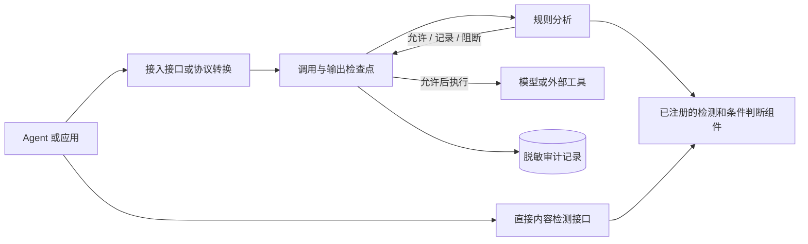

# Agent Guardrail

**面向 AI Agent 的可解释安全规则分析与执行控制框架。**

[English](README.md) | 简体中文

[](pyproject.toml) [](pyproject.toml) [](docs/roadmap.md) [](LICENSE)

部署者接入内容检测组件并编写安全规则。Agent Guardrail 读取 Agent 运行过程中的消息、模型调用、工具调用和工具结果，根据规则给出允许、记录或阻断结果，并在模型或工具真正执行前以及输出交给 Agent 前落实结果。

框架保证规则按照固定方式加载和执行，并保证调用前阻断能够停止受保护的操作。内容检测的准确度取决于所选检测组件；实际安全效果取决于应用采用的具体规则和真实工作负载。

> **项目状态 — v0.1.0 alpha。** 程序化内容检测接口、规则接口、模型调用代理、基于 MCP 标准协议的工具调用代理、流式输出检查、单个任务的内存执行记录，以及独立部署的规则分析服务已经实现并通过测试。MCP 用于 Agent 调用外部工具。当前部署模型服务一个用户；宿主基础设施提供进程隔离、持久化状态、身份和资源限制。

## Agent Guardrail 提供什么？

- **分析与执行边界。** 应用可以自行调用规则分析；代理服务可以在模型或工具调用前以及输出释放前实施阻断。
- **统一的规则执行路径。** 严格的 YAML 配置会生成一份不可变的内部执行计划，所有允许、记录和阻断结果都由同一路径产生。
- **纯数据规则配置。** YAML 只能选择部署者预先注册的检测和判断能力；实现代码、文件、进程、网络地址和访问权限始终由部署代码持有。
- **结构化执行记录。** 消息、模型调用、模型建议的工具调用、实际工具调用和工具结果都保存为不可变记录；显式连接描述某条早期记录如何产生或影响后续操作，时间顺序只描述先后关系。
- **部署者选择检测能力。** 模型、规则集、外部进程和凭据由部署者配置，安全规则只能使用已注册的名称和有界参数。
- **脱敏证据。** 命中结果、违规记录、错误和审计记录保存结构化遮罩信息。

## 架构



安全规则读取结构化执行记录以及记录之间的明确联系。模型和工具代理把外部协议转换成统一记录，并在四个位置检查规则。下面四个英文名称是代码中的接入点，分别表示模型调用前、模型输出释放前、工具调用前和工具结果释放前：

```text
before_model_call → LLM → before_model_output_release
before_tool_call  → Tool → before_tool_output_release
```

每次分析都读取已经确认的执行历史和当前待检查的完整操作。允许和记录会一次性保存当前操作；阻断会保存脱敏结果，并丢弃当前操作中的原始内容。

技术文档和 API 使用以下名称：`Policy` 表示 YAML 安全规则，`Detector` 表示内容检测组件，`Event` 表示一条结构化执行记录，`Relation` 表示两条记录之间明确的产生或影响关系，`Decision` 表示允许、记录或阻断结果，`Trace` 表示一个任务的连续执行历史，`Gateway` 表示位于 Agent 与模型或工具服务之间的代理，`Core` 表示可以独立部署的规则分析服务，`capability` 表示规则可以引用的已注册检测或条件判断能力。

## 快速开始

需要 Python 3.12 或更高版本，以及 [uv](https://docs.astral.sh/uv/)。

```bash
git clone https://github.com/cipeizheng/agent-guardrail.git
cd agent-guardrail
uv sync --frozen --extra gateway --dev
uv run python examples/secret_email_demo.py
```

演示使用确定性的 Fake Model 和 Fake Tool，不需要 API Key。关键输出是：

```text
blocked before tool execution
llm executions: 1
send_email executions: 0
```

输出记录一次模型调用；规则阻断包含密钥的工具调用建议后，邮件工具执行次数为零。

## 使用 YAML 配置安全规则

代码和文档使用 `Policy` 表示 YAML 安全规则。下面的规则会在 `send_email` 的参数包含密钥时阻断工具调用：

```yaml
version: 3

engine:
  on_analysis_error: block
  on_detector_timeout: block

scopes: [pending]

rules:
  - id: prevent-secret-email
    action: block
    events:
      call:
        kind: tool_call_proposal
        domain: pending
    where:
      all:
        - tool: {binding: call, name: send_email}
        - detector:
            id: secret_scan
            capability: secrets
            inputs:
              - value: {field: [call, payload, arguments]}
                encoding: canonical_json
    finding:
      code: secret_exfiltration
      message: The tool call contains secret material.
      subjects: [call]
      evidence: [{source: detector, id: secret_scan}]
```

Runtime 激活前，Loader 会拒绝重复键、未知字段、宽松类型、YAML alias/tag、非法引用和不可用 capability。binding、relation、quantifier、派生值、Finding、预算和可信安全参数见[Policy 作者指南](docs/guides/policy-authoring.md)。

## 接入方式

| 接入方式 | 适用场景 | 当前保证 |
| --- | --- | --- |
| 直接 Detector SDK | 任意 Python 代码需要在某个插入点获得检测 fact | 无 YAML；有界 text/JSON/batch 检测，动作由应用决定 |
| Event/Policy SDK | 任意 Python Agent/Framework 能暴露语义 Event | 无需框架专用 Adapter；应用选择插入点并携带显式 `EventRef` Relation |
| Inline Wrapper | 可以注入 LLM 与 Tool 接口 | 中介经过共享任务级 Session 的调用 |
| Model Provider Gateway | OpenAI Chat/Responses、Anthropic Messages 或部署 Adapter | 完整请求检查；非流式原子输出检查；不可撤回的前缀检查 SSE；可选共享任务 Trace |
| MCP Gateway | Tool 来自固定 MCP Server | 每个 `tools/call` 都经过检查；经校验的 proposal 引用可在执行前连接模型 Trace |
| Remote Core | Policy/Detector 资产需要与边缘流量隔离 | Gateway 持有流量和副作用，Core 分析完整 `PendingTrace` |
| Docker Compose | 自托管 Core + Gateway | 只读容器、Core 私网、Provider/Core 凭据隔离 |

直接检测不需要 Policy 文件：

```python
from agent_guardrail import DetectorRunner

detectors = DetectorRunner.from_profile("local")
result = await detectors.detect("prompt_injection", retrieved_text)
if result.detected:
    reject_untrusted_content()
```

结果是脱敏 fact，不是 allow/block Decision。`detect_text`、`detect_json`、`detect_many` 与 YAML/MatchPlan 的 Detector condition 共享完全相同的 descriptor、timeout、结果上限和脱敏执行边界；backend 异常会抛出脱敏 `DetectorExecutionError`，不会静默变成“未命中”。

OpenAI Client 只需要修改 base URL：

```python
from openai import OpenAI

client = OpenAI(
    api_key="gateway-key",
    base_url="http://127.0.0.1:8080/v1/openai",
)
```

`client.chat.completions.create(...)` 与 `client.responses.create(...)` 都支持 `stream=False/True`。Streaming 只释放已经检查的累计文本前缀与完整验证的 Tool arguments；后续 block 不能撤回早先窗口。需要完整输出原子判断时使用 `stream=False`。可信部署可在 `/v1/providers/...` 注册非 OpenAI wire Adapter，客户端仍不能选择上游 URL。

Anthropic Client 使用 Gateway 根地址：

```python
from anthropic import Anthropic

client = Anthropic(
    api_key="gateway-key",
    base_url="http://127.0.0.1:8080",
)
```

当前覆盖 Messages 文本、client `tools/tool_use/tool_result` 及流式事件；`mcp_servers`、Anthropic server tools、thinking 和多模态会失败关闭，避免服务端工具执行绕过本项目的 MCP Enforcement。

MCP Python SDK v2：

```python
from mcp import Client

async with Client("http://127.0.0.1:8080/v1/mcp", cache=None) as client:
    result = await client.call_tool("send_email", {"to": "outside@example.com"})
```

生命周期和协议细节见[接入指南](docs/guides/integration.md)与[Gateway 协议参考](docs/reference/gateway-protocol.md)。

## 检测与条件判断能力

本节中的“能力”表示部署者注册的检测组件或条件判断组件；表格中的名称是规则文件使用的固定标识。默认 `local` 配置使用本地确定性组件：

- Detector：`secrets`、`pii`、`prompt_injection`、`unicode_security`、`python_ast_ipython`、`hidden_content`。
- 纯 Predicate：`number_in_range`、`length_in_range`、`url_host_allowed`、`fuzzy_contains`。

部署固定的可选能力与默认目录明确分离：

| 可用方式 | Capability | Backend 边界 |
| --- | --- | --- |
| `full_deberta` | `prompt_injection_model` | 锁定 Protect AI DeBERTa checkpoint，本地 CPU/CUDA 推理 |
| `full_deberta` | 增强 `pii` | 锁定 Presidio/spaCy 英文 NER，加本地 validator |
| `full_deberta` | `semgrep` | 隔离且锁定版本的 CLI 与包内 Python ruleset |
| `full_deberta` | `yara_injection_signatures` | 锁定 yara-python、包内 ruleset 与固定 rule-to-type 映射 |
| `full_promptguard2` | `prompt_injection_model` | 全栈同 `full_deberta`，仅 DeBERTa 换成 PromptGuard 2 86M（候选 profile，Llama 4 license）|
| `promptguard2` | `prompt_injection_model` | 仅 PromptGuard 2（无 presidio/semgrep/yara），用于 eval 隔离与轻量部署 |
| 显式注入 | `is_similar` 与 `prompt_injection_judge` | 部署选择的 embedding / LLM judge backend（均为 `adapter_only`）|

真实 `prompt_injection_model` backend 当前状态为 `baseline`。锁定的公开语料测量其检测特性，包括盲区和过度防御。`is_similar` 与 `prompt_injection_judge` 当前状态为 `adapter_only`，各项 capability 的交付状态与验证范围记录在[Capability 状态矩阵](docs/capability-status.yaml)中。可复现的第三方 Detector 特性评估位于[`evals/prompt_injection`](evals/prompt_injection/README.md)。

验证证据具有明确范围：

| 证据 | 范围 |
| --- | --- |
| 单元测试与集成测试 | 规则加载与匹配、允许/记录/阻断结果、调用检查点、输出释放、故障处理，以及调用前阻断后受保护操作的执行次数为零 |
| 检测组件特性评估 | 指定检测组件在锁定版本语料上的召回率、误报率和可用阈值 |
| 能力状态矩阵 | 每个检测组件和条件判断组件的交付状态与验证范围 |

仓库当前发布检测组件的分类指标。具体规则集与真实 Agent 部署负责各自工作负载的安全和效用指标。

## 部署组件组合

下文的 profile 表示一组预先命名的检测组件和依赖配置。

### 默认本地 Profile

默认 profile 轻量且确定性执行，不加载 Transformers、Presidio、Semgrep、YARA 或远程 embedding client。

### 完整本地 Profile

`full_deberta` 在启动前固定并校验 Detector 依赖和模型资产：

```bash
uv sync --frozen --extra gateway --extra detectors --no-dev
uv tool install semgrep==1.170.0
export AGENT_GUARDRAIL_DETECTOR_ASSETS_DIR=/var/lib/agent-guardrail/detectors
uv run agent-guardrail-prefetch-detectors
export AGENT_GUARDRAIL_DETECTOR_PROFILE=full_deberta
```

依赖、版本、checksum 或所选 CUDA 设备不符合 profile 时，Runtime 会拒绝启动。Policy YAML 仍不能替换这些选择。

### PromptGuard 2 候选 Profile（逐组件可自由组合）

除闭式 preset 外，Detector 组件可逐项独立开关（`detector_pii` / `detector_semgrep` / `detector_yara` / `detector_prompt_model`，如 `pii=presidio, prompt_model=promptguard2, semgrep/yara=none`）。组件与 preset 互斥：设了非 `local` 的 preset 就不能再设组件变量；组件变量的合法组合全部放行，但组合本身可能未经端到端一致性验证，风险由部署方评估。

`full_promptguard2` 与 `promptguard2` 使用 Meta Llama-Prompt-Guard-2-86M 的 ONNX 镜像 （gated 原仓库经未 gate 的 `gravitee-io` 镜像分发，权重哈希一致），默认阈值 0.9。它们**不是默认 profile**：配套 Llama 4 Community License（非 MIT，含 700M MAU 条款，需 "Built with Llama" 署名），`full_deberta` 仍为 verified 默认。启动前用 `agent-guardrail-prefetch-promptguard2` 预取资产。

### Docker Compose

```bash
cp .env.example .env
# 替换 .env 中的全部占位值。
docker compose build
docker compose up -d
curl --fail http://127.0.0.1:8080/health/ready
```

Core 镜像包含完整 Detector profile，因此体积较大。在本地环境之外部署前请先阅读[运行指南](docs/guides/operations.md)。

## 当前边界

Agent Guardrail 只能中介实际经过 Wrapper 或 Gateway 的流量。当前不提供：

- 持久化/分布式 Session、自动 history cursor 或 Policy 热更新；
- 对直接 Shell、函数、文件系统或任意 HTTP 的 Sandbox/拦截；
- Web 管理界面或分布式 Policy 服务；
- Moderation、copyright 或 OCR capability。

多用户身份、租户隔离、跨用户共享和按用户授权属于明确的产品范围外能力，而不是后置功能。

如果 Agent 能执行 Shell 或任意代码，应将其部署在独立 Sandbox 中：网络 egress 默认拒绝、文件系统临时且最小化、资源有硬上限，并且不持有 Provider 或 Tool 凭据。Guardrail Gateway、Policy/Core、持有凭据的 Tool Broker 和 Audit 应位于 Sandbox 外。模式、代码和 URL Detector 无法阻止未被观察到的 `curl`、socket、syscall、凭据读取、持久化、资源耗尽或 Sandbox 逃逸。详见[威胁边界矩阵](docs/security-model.md#8-guardrail-无法替代的-sandbox-控制)和[部署检查清单](docs/guides/operations.md#3-agent-sandbox-与不可绕过部署边界)。

Detector 命中不能证明恶意意图或授权。生产 Rule 应当把 Detector fact 与可信 source/sink 语境组合。权威边界以[当前架构合同](docs/current-architecture-contract.md)和[安全模型](docs/security-model.md)为准。

## 文档

| 阅读内容 | 适用场景 |
| --- | --- |
| [文档导航](docs/README.md) | 为当前任务选择最短阅读路径 |
| [架构概览](docs/overview.md) | 理解 Event、MatchPlan、Runtime 和 Enforcement |
| [Policy 作者指南](docs/guides/policy-authoring.md) | 编写严格生产 YAML Policy |
| [Capability 参考](docs/reference/capabilities.md) | 使用 Detector、Predicate 与可选 backend |
| [接入指南](docs/guides/integration.md) | 接入 Agent、OpenAI/Anthropic Client 或 MCP Client |
| [运行指南](docs/guides/operations.md) | 配置 Secret、profile、Docker、Audit 和 Health |
| [安全模型](docs/security-model.md) | 审查资产、信任边界和 T01–T10 |
| [Roadmap](docs/roadmap.md) | 查看规划且不与已交付行为混淆 |

## 开发

```bash
uv sync --frozen --extra gateway --dev
uv run pytest --cov=agent_guardrail --cov-report=term-missing
uv run ruff check .
uv run pyright
uv build
git diff --check
```

欢迎参与贡献。请从 [CONTRIBUTING.md](CONTRIBUTING.md) 开始；架构和安全修改必须继续遵守仓库内已有合同。

## License

Agent Guardrail 源码使用 [MIT License](LICENSE)。提示注入 Model Detector（PromptGuard 2 profiles）附带 Llama 4 Community License（非 MIT），因此这些 profile 是 opt-in 候选而非默认。
