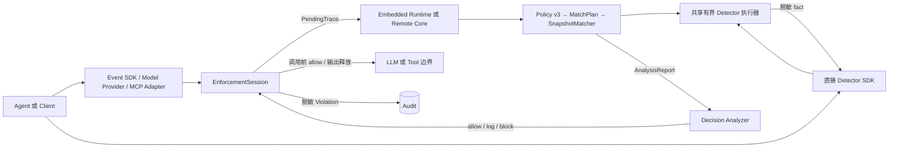

# Agent Guardrail

**面向 AI Agent 的可解释 Policy Analyzer 与 Enforcement Gateway。**

[English](README.md) | 简体中文

[](pyproject.toml)
[](pyproject.toml)
[](docs/roadmap.md)
[](LICENSE)

Agent Guardrail 可以不写 YAML 直接运行有界 Detector，也可以把严格 YAML Policy 编译为不可变 MatchPlan，
对跨 Event 行为返回可解释 Decision。两种模式都提供框架无关 SDK；Gateway 还会在具体模型与工具执行检查点
强制落实 Decision。

项目聚焦三类资产：**用户数据、用户意图和用户资源**。Detector 命中只是证据，不会单独成为安全结论；
Policy 还需要把这些事实与可信的 source、destination 和 authorization 语境组合。

> **项目状态 — v0.1.0 alpha。** 直接 Detector SDK、Event/Policy SDK、Core Runtime、Inline Wrapper、
> Provider-neutral Adapter 合同、OpenAI Chat/Responses 流式 Gateway、无状态 MCP Gateway 和远程 Core
> 路径已经实现并通过测试。应用明确只供单用户使用；它不是完整 Sandbox 或持久 Session 服务，也不建模
> 用户目录、租户或数据所有权。

## 为什么使用 Agent Guardrail？

- **分析与可执行边界。** SDK 用户自行决定 Decision 的执行位置；Gateway 会在模型/工具调用前以及输出释放前
  实施阻断。
- **唯一、可审计的 Policy 链。** 严格 `version: 3` YAML 进入 `MatchPlan → AnalysisReport → Decision`，
  不存在第二套生产解释器。
- **Policy 不是可执行载荷。** YAML 不能 import Python、注册 callback、选择文件或网络 endpoint，也不能
  获得任意 I/O 权限。
- **类型化 Trace 与显式 Relation。** Message、ModelCall、ToolCallProposal、实际 ToolCall 和 ToolResult
  都是不可变 Event；时间先后不会被静默当作 provenance。
- **部署方拥有 capability。** 模型、规则集、进程和凭据由部署选择，Policy 只能看到审查过的 capability
  名称与有界参数。
- **默认脱敏。** Finding、Violation、Error 和可选 Audit 保存结构化遮罩证据，不保存原始 Secret、PII
  或 prompt。

## 架构



Policy 描述语义 Event 与 Relation，不绑定执行位置。Gateway Adapter 将 Provider 流量转换为这些 Event，
并在四个执行检查点实施 Decision：

```text
before_model_call → LLM → before_model_output_release
before_tool_call  → Tool → before_tool_output_release
```

分析始终读取已提交 Trace 加完整 pending Event batch。allow/log 会原子提交整批 Event；block 会丢弃原始
pending Event，只提交脱敏 Decision Event。

## 快速开始

需要 Python 3.12 或更高版本，以及 [uv](https://docs.astral.sh/uv/)。

```bash
git clone https://github.com/cipeizheng/agent-guardrail.git
cd agent-guardrail
uv sync --frozen --extra gateway --dev
uv run python examples/secret_email_demo.py
```

演示使用确定性的 Fake Model 和 Fake Tool，不需要 API Key。关键输出是：

```text
blocked before tool execution
llm executions: 1
send_email executions: 0
```

模型提出了包含 Secret 的 ToolCall，但受保护的邮件工具完全没有执行。

## Policy 是数据，不是代码

下面的 Policy 会在 `send_email` 参数包含 Secret 时阻断 ToolCall：

```yaml
version: 3

engine:
  on_analysis_error: block
  on_detector_timeout: block

scopes: [pending]

rules:
  - id: prevent-secret-email
    action: block
    events:
      call:
        kind: tool_call_proposal
        domain: pending
    where:
      all:
        - tool: {binding: call, name: send_email}
        - detector:
            id: secret_scan
            capability: secrets
            inputs:
              - value: {field: [call, payload, arguments]}
                encoding: canonical_json
    finding:
      code: secret_exfiltration
      message: The tool call contains secret material.
      subjects: [call]
      evidence: [{source: detector, id: secret_scan}]
```

Runtime 激活前，Loader 会拒绝重复键、未知字段、宽松类型、YAML alias/tag、非法引用和不可用 capability。
binding、relation、quantifier、派生值、Finding、预算和可信安全参数见
[Policy 作者指南](docs/guides/policy-authoring.md)。

## 接入方式

| 接入方式 | 适用场景 | 当前保证 |
| --- | --- | --- |
| 直接 Detector SDK | 任意 Python 代码需要在某个插入点获得检测 fact | 无 YAML；有界 text/JSON/batch 检测，动作由应用决定 |
| Event/Policy SDK | 任意 Python Agent/Framework 能暴露语义 Event | 无需框架专用 Adapter；应用选择插入点并携带显式 `EventRef` Relation |
| Inline Wrapper | 可以注入 LLM 与 Tool 接口 | 中介经过共享任务级 Session 的调用 |
| Model Provider Gateway | OpenAI Chat/Responses 或部署 Adapter | 完整请求检查；非流式原子输出检查；不可撤回的前缀检查 SSE |
| MCP Gateway | Tool 来自固定 MCP Server | 每个无状态 `tools/call` 都经过执行前后检查 |
| Remote Core | Policy/Detector 资产需要与边缘流量隔离 | Gateway 持有流量和副作用，Core 分析完整 `PendingTrace` |
| Docker Compose | 自托管 Core + Gateway | 只读容器、Core 私网、Provider/Core 凭据隔离 |

直接检测不需要 Policy 文件：

```python
from agent_guardrail import DetectorRunner

detectors = DetectorRunner.from_profile("local")
result = await detectors.detect("prompt_injection", retrieved_text)
if result.detected:
    reject_untrusted_content()
```

结果是脱敏 fact，不是 allow/block Decision。`detect_text`、`detect_json`、`detect_many` 与 YAML/MatchPlan 的
Detector condition 共享完全相同的 descriptor、timeout、结果上限和脱敏执行边界；backend 异常会抛出脱敏
`DetectorExecutionError`，不会静默变成“未命中”。

OpenAI Client 只需要修改 base URL：

```python
from openai import OpenAI

client = OpenAI(
    api_key="gateway-key",
    base_url="http://127.0.0.1:8080/v1/openai",
)
```

`client.chat.completions.create(...)` 与 `client.responses.create(...)` 都支持
`stream=False/True`。Streaming 只释放已经检查的累计文本前缀与完整验证的 Tool arguments；后续 block
不能撤回早先窗口。需要完整输出原子判断时使用 `stream=False`。可信部署可在 `/v1/providers/...` 注册非
OpenAI wire Adapter，客户端仍不能选择上游 URL。

MCP Python SDK v2：

```python
from mcp import Client

async with Client("http://127.0.0.1:8080/v1/mcp", cache=None) as client:
    result = await client.call_tool("send_email", {"to": "outside@example.com"})
```

生命周期和协议细节见[接入指南](docs/guides/integration.md)与
[Gateway 协议参考](docs/reference/gateway-protocol.md)。

## Capability

默认 `local` Registry 不下载模型，发布：

- Detector：`secrets`、`pii`、`prompt_injection`、`unicode_security`、
  `python_ast_ipython`、`hidden_content`。
- 纯 Predicate：`number_in_range`、`length_in_range`、`url_host_allowed`、`fuzzy_contains`。

部署固定的可选能力与默认目录明确分离：

| 可用方式 | Capability | Backend 边界 |
| --- | --- | --- |
| `full_local_v1` | `prompt_injection_model` | 锁定 Protect AI DeBERTa checkpoint，本地 CPU/CUDA 推理 |
| `full_local_v1` | 增强 `pii` | 锁定 Presidio/spaCy 英文 NER，加本地 validator |
| `full_local_v1` | `semgrep` | 隔离且锁定版本的 CLI 与包内 Python ruleset |
| `full_local_v1` | `yara_injection_signatures` | 锁定 yara-python、包内 ruleset 与固定 rule-to-type 映射 |
| `full_local_promptguard2` | `prompt_injection_model` | 全栈同 v1，仅 DeBERTa 换成 PromptGuard 2 86M（候选 profile，Llama 4 license） |
| `promptguard2_only` | `prompt_injection_model` | 仅 PromptGuard 2（无 presidio/semgrep/yara），用于 eval 隔离与轻量部署 |
| 显式注入 | `is_similar` 与 `prompt_injection_judge` | 部署选择的 embedding / LLM judge backend（均为 `adapter_only`） |

真实 `prompt_injection_model` backend 当前只是 `baseline`，不是完整防御：锁定的 BIPIA/NotInject 公开
评测暴露出攻击召回低和明显过度防御。`is_similar` 与 `prompt_injection_judge` 仍为 `adapter_only`，因为
真实外部 embedding / LLM judge 服务尚未达到 verified。所有 capability 的准确、非营销状态只以[Capability 状态矩阵](docs/capability-status.yaml)
为准；可复现 Detector 评测位于 [`evals/prompt_injection`](evals/prompt_injection/README.md)。独立的
[`evals/agentdojo`](evals/agentdojo/README.md) pilot 另行测量真实 Agent 的任务效用和 targeted ASR；Adapter
smoke 不算已完成的真实模型结果。

## 部署 Profile

### 默认本地 Profile

默认 profile 轻量且确定性执行，不加载 Transformers、Presidio、Semgrep、YARA 或远程 embedding client。

### 完整本地 Profile

`full_local_v1` 在启动前固定并校验 Detector 依赖和模型资产：

```bash
uv sync --frozen --extra gateway --extra detectors --no-dev
uv tool install semgrep==1.170.0
export AGENT_GUARDRAIL_DETECTOR_ASSETS_DIR=/var/lib/agent-guardrail/detectors
uv run agent-guardrail-prefetch-detectors
export AGENT_GUARDRAIL_DETECTOR_PROFILE=full_local_v1
```

依赖、版本、checksum 或所选 CUDA 设备不符合 profile 时，Runtime 会拒绝启动。Policy YAML 仍不能替换
这些选择。

### PromptGuard 2 候选 Profile（逐组件可自由组合）

除闭式 preset 外，Detector 组件可逐项独立开关（`detector_pii` / `detector_semgrep` /
`detector_yara` / `detector_prompt_model`，如 `pii=presidio, prompt_model=promptguard2,
semgrep/yara=none`）。组件与 preset 互斥：设了非 `local` 的 preset 就不能再设组件变量；组件变量的合法
组合全部放行，但组合本身可能未经端到端一致性验证，风险由部署方评估。

`full_local_promptguard2` 与 `promptguard2_only` 使用 Meta Llama-Prompt-Guard-2-86M 的 ONNX 镜像
（gated 原仓库经未 gate 的 `gravitee-io` 镜像分发，权重哈希一致），默认阈值 0.9。它们**不是默认
profile**：配套 Llama 4 Community License（非 MIT，含 700M MAU 条款，需 "Built with Llama" 署名），
`full_local_v1` 仍为 verified 默认。启动前用 `agent-guardrail-prefetch-promptguard2` 预取资产。

### Docker Compose

```bash
cp .env.example .env
# 替换 .env 中的全部占位值。
docker compose build
docker compose up -d
curl --fail http://127.0.0.1:8080/health/ready
```

Core 镜像包含完整 Detector profile，因此体积较大。在本地环境之外部署前请先阅读
[运行指南](docs/guides/operations.md)。

## 当前边界

Agent Guardrail 只能中介实际经过 Wrapper 或 Gateway 的流量。当前不提供：

- 跨请求 Session 状态或 Policy 热更新；
- 对直接 Shell、函数、文件系统或任意 HTTP 的 Sandbox/拦截；
- Web 管理界面或分布式 Policy 服务；
- Moderation、copyright 或 OCR capability。

多用户身份、租户隔离、跨用户共享和按用户授权属于明确的产品范围外能力，而不是后置功能。

如果 Agent 能执行 Shell 或任意代码，应将其部署在独立 Sandbox 中：网络 egress 默认拒绝、文件系统临时且
最小化、资源有硬上限，并且不持有 Provider 或 Tool 凭据。Guardrail Gateway、Policy/Core、持有凭据的
Tool Broker 和 Audit 应位于 Sandbox 外。模式、代码和 URL Detector 无法阻止未被观察到的 `curl`、socket、
syscall、凭据读取、持久化、资源耗尽或 Sandbox 逃逸。详见[威胁边界矩阵](docs/security-model.md#8-guardrail-无法替代的-sandbox-控制)
和[部署检查清单](docs/guides/operations.md#3-agent-sandbox-与不可绕过部署边界)。

Detector 命中不能证明恶意意图或授权。生产 Rule 应当把 Detector fact 与可信 source/sink
语境组合。权威边界以[当前架构合同](docs/current-architecture-contract.md)和
[安全模型](docs/security-model.md)为准。

## 文档

| 阅读内容 | 适用场景 |
| --- | --- |
| [文档导航](docs/README.md) | 为当前任务选择最短阅读路径 |
| [架构概览](docs/overview.md) | 理解 Event、MatchPlan、Runtime 和 Enforcement |
| [Policy 作者指南](docs/guides/policy-authoring.md) | 编写严格生产 YAML Policy |
| [Capability 参考](docs/reference/capabilities.md) | 使用 Detector、Predicate 与可选 backend |
| [接入指南](docs/guides/integration.md) | 接入 Agent、OpenAI Client 或 MCP Client |
| [运行指南](docs/guides/operations.md) | 配置 Secret、profile、Docker、Audit 和 Health |
| [安全模型](docs/security-model.md) | 审查资产、信任边界和 T01–T10 |
| [Roadmap](docs/roadmap.md) | 查看规划且不与已交付行为混淆 |

## 开发

```bash
uv sync --frozen --extra gateway --dev
uv run pytest --cov=agent_guardrail --cov-report=term-missing
uv run ruff check .
uv run pyright
uv build
git diff --check
```

欢迎参与贡献。请从 [CONTRIBUTING.md](CONTRIBUTING.md) 开始；架构和安全修改必须继续遵守仓库内已有合同。

## License

Agent Guardrail 源码使用 [MIT License](LICENSE)。提示注入 Model Detector（PromptGuard 2 profiles）附带
Llama 4 Community License（非 MIT），因此这些 profile 是 opt-in 候选而非默认。
