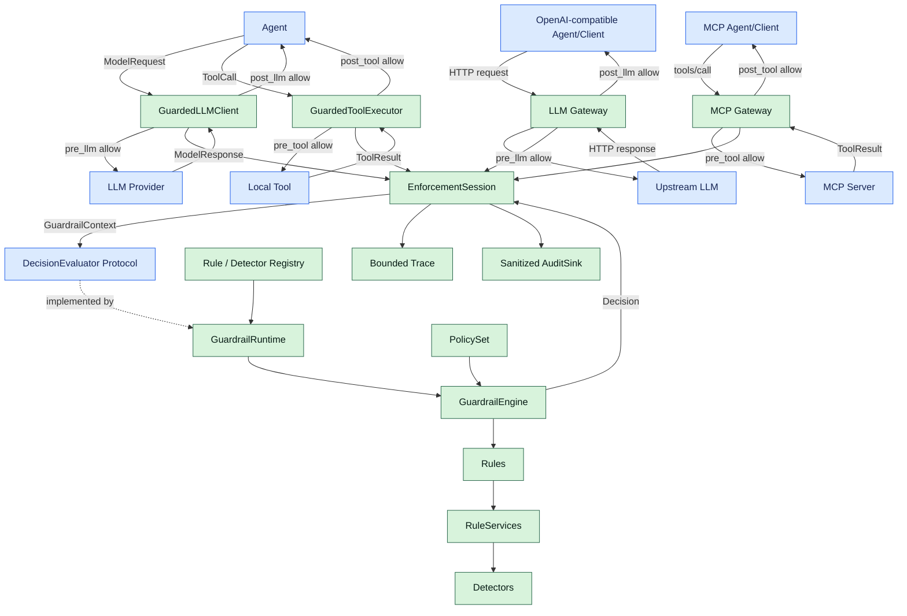
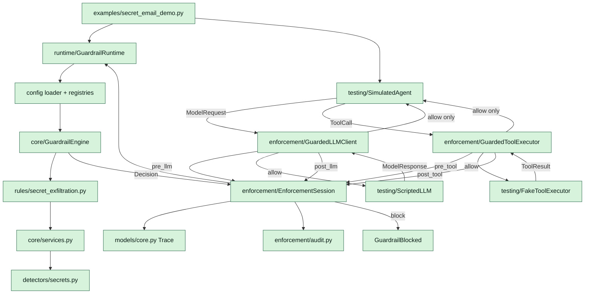

# 架构图与代码阅读地图

本文展示当前已经运行的 Inline、OpenAI Gateway 与 MCP `2026-07-28` Gateway 架构。

## 1. 状态图例

- 绿色：当前已经实现并有测试。
- 蓝色：当前图中的协议或调用方。
- 灰色：后续扩展。

## 2. 当前架构总图



拦截器位于通信边上，不位于 Agent 内部：

- `post_llm`：`LLM → GuardedLLMClient/Gateway → Agent`。
- `pre_tool`：`Agent → GuardedToolExecutor/MCP Gateway → Tool`。
- `post_tool`：`Tool → GuardedToolExecutor/MCP Gateway → Agent`。

Agent 是被保护的调用方，不是拦截点本身。

这条主链可以缩写为：

```text
Agent/Client
  → Enforcement Point
  → EnforcementSession
  → DecisionEvaluator
  → GuardrailRuntime
  → GuardrailEngine
  → Rule/Detector
  → Decision
  → Enforcement Point 执行 allow/log/block
```

## 3. 三个新抽象分别解决什么

### 3.1 GuardrailRuntime

Runtime 是 Core 的本地公共门面，相当于“已经装配好的 Guardrail 服务对象”。它负责：

- 从完整校验的 Policy、Registry 和 Detector 构造 Engine。
- 管理启动、关闭和 Readiness。
- 向调用方隐藏 Engine 的构造细节。
- 暴露安全的 Policy version/hash。
- 接收 Context 并返回 Decision。

Runtime 不创建 Provider Event，不请求 LLM，不执行 Tool，也不决定 HTTP 状态码。

### 3.2 EnforcementSession

Session 是“一次 Agent 任务或 Gateway 请求的安全上下文”。它负责：

- 持有这次任务独占的 Trace。
- 统一分配 Event ID、时间和 sequence。
- 调用 DecisionEvaluator。
- `allow/log` 时提交原 Event。
- `block` 时丢弃可能敏感的原 Event，只提交脱敏 Decision Event。
- 将含 Violation 的 Decision 发给 AuditSink。

它解决了旧 `GuardedToolExecutor` 自己管理 Trace/Audit、LLM 与 Tool 可能重复实现状态管理的
问题。两个 Wrapper 共享一个 Session，因而能看到同一条 Agent 历史。

### 3.3 DecisionEvaluator

它只是一个很小的接口：

```python
class DecisionEvaluator(Protocol):
    async def evaluate(self, context: GuardrailContext) -> Decision: ...
```

Session 依赖接口，不依赖具体 Engine：

- MVP：`GuardrailRuntime` 实现它，所有判断都在本进程完成。
- 测试：可注入 Fake Evaluator，精确返回 allow/log/block。
- 未来：如果确实拆分 Core，Remote Client 也可以实现它。

它不是新的服务，也不执行规则；作用是让 Enforcement 与具体判断实现解耦。

## 4. 当前实际执行路径

下面这张图画 Inline 路径；Gateway 路径见本节后的 HTTP 调用链：



当前关键事实：

- `GuardedLLMClient` 在调用 Provider 前执行 pre_llm，在把响应交给 Agent 前执行 post_llm。
- `GuardedToolExecutor` 在实际工具执行前执行 pre_tool，在结果交回 Agent 前执行 post_tool。
- 两个 Wrapper 共享同一 EnforcementSession/Trace，并只依赖 DecisionEvaluator。
- `SimulatedAgent` 只依赖普通 LLMClient/ToolExecutor Protocol，不导入 Guardrail 实现。
- Secret ToolCall 默认在 post_llm 阻断；只有实际执行也经过 `GuardedToolExecutor` 或 MCP Gateway
  时，pre_tool 才能继续保护工具副作用。
- OpenAI Gateway 与现代 MCP Gateway 均已实现。

Gateway 的实际调用链：

```text
OpenAI Agent（只改 base_url）
  → gateway/app.py
  → adapters/openai（严格解析与 Canonical 转换）
  → 请求级 EnforcementSession → Runtime（pre_llm）
  → gateway/upstream.py → 固定 LLM Provider
  → adapters/openai（响应与 ToolCall Schema 校验）
  → 同一 Session → Runtime（post_llm）
  → allow: OpenAI Response / block: 脱敏错误
```

MCP Gateway 的实际调用链：

```text
MCP Agent（官方 SDK，只改 server URL）
  → POST /v1/mcp → gateway/mcp.py
  → adapters/mcp（2026-07-28 envelope 与 routing header 严格校验）
  → tools/call：请求级 EnforcementSession → Runtime（pre_tool）
  → gateway/mcp_upstream.py → 固定 MCP Server
  → adapters/mcp（完整、有界解析 JSON 或请求级 SSE ToolResult）
  → 同一 Session → Runtime（post_tool）
  → allow: 原协议响应 / block: JSON-RPC -32040，隐藏原结果
```

`server/discover`、`ping` 和 `tools/list` 做严格校验后透传，不创建伪造的 Tool Event。现代 MCP
没有 `initialize` 或协议 Session；每个 `tools/call` 都是独立安全边界。

当前默认 Registry 只有 `secret_exfiltration` Rule 和 `secrets` Detector；图中的 Rule/Detector
扩展点已经存在，但其他规则目录尚未实现。

## 5. 当前代码模块

| 当前文件 | 当前作用 | 状态 |
|---|---|---|
| `models/core.py` | Canonical Event/Trace/Decision | 已实现 |
| `core/engine.py` | Runtime 内部的单次 Rule 评估与 Decision 聚合 | 已实现 |
| `core/policy.py` | 严格配置与不可变 PolicySet | 已实现 |
| `core/registry.py` | 由 Runtime bootstrap 使用的显式 Registry | 已实现 |
| `core/services.py` | Detector 调用、超时和单次缓存 | 已实现 |
| `models/chat.py` | Provider-neutral LLM Request/Response | 已实现 |
| `enforcement/protocols.py` | LLM/Tool/Audit 接口 | 已实现 |
| `enforcement/inline_llm.py` | pre_llm/post_llm Wrapper | 已实现 |
| `enforcement/inline_tools.py` | pre_tool/post_tool Wrapper | 已实现 |
| `enforcement/session.py` | 共享 Trace、Decision 与脱敏提交 | 已实现 |
| `runtime/runtime.py`、`bootstrap.py` | Runtime 门面与显式装配 | 已实现 |
| `testing/fakes.py`、`simulated_agent.py` | Fake 和纯协议 Agent | 已实现 |
| `adapters/openai/` | OpenAI 封闭模型、Canonical 转换与 Tool Schema 校验 | 已实现 |
| `adapters/mcp/` | MCP 2026-07-28 Envelope、Header、Canonical Tool 双向转换 | 已实现 |
| `gateway/app.py`、`config.py`、`upstream.py` | HTTP 服务、配置和固定 OpenAI 上游 | 已实现 |
| `gateway/mcp.py`、`mcp_upstream.py` | MCP Tool Enforcement 和固定 MCP 上游 | 已实现 |

## 6. 推荐按这个顺序读当前代码

1. [`models/core.py`](../src/agent_guardrail/models/core.py)：理解 Event、Phase、Trace、Violation、Decision。
2. [`models/chat.py`](../src/agent_guardrail/models/chat.py)：理解 Agent 与 LLM 之间的数据。
3. [`core/protocols.py`](../src/agent_guardrail/core/protocols.py)：理解 Rule 与 Detector 的职责边界。
4. [`core/policy.py`](../src/agent_guardrail/core/policy.py) 和 [`core/registry.py`](../src/agent_guardrail/core/registry.py)：理解可信策略装配。
5. [`core/engine.py`](../src/agent_guardrail/core/engine.py)：看 Rule 选择、错误处理和 Decision 聚合。
6. [`rules/secret_exfiltration.py`](../src/agent_guardrail/rules/secret_exfiltration.py)：看 post_llm/pre_tool 双阶段规则。
7. [`runtime/runtime.py`](../src/agent_guardrail/runtime/runtime.py)：看 Core 公共门面和生命周期。
8. [`enforcement/session.py`](../src/agent_guardrail/enforcement/session.py)：看 Event 如何评估、提交和脱敏。
9. [`enforcement/inline_llm.py`](../src/agent_guardrail/enforcement/inline_llm.py)：看 LLM 响应如何在 Agent 前被拦截。
10. [`enforcement/inline_tools.py`](../src/agent_guardrail/enforcement/inline_tools.py)：看实际 Tool 副作用如何被拦截。
11. [`testing/simulated_agent.py`](../src/agent_guardrail/testing/simulated_agent.py)：确认 Agent 只依赖普通 Protocol。
12. [`gateway/app.py`](../src/agent_guardrail/gateway/app.py)：看 HTTP request-scoped Enforcement。
13. [`adapters/openai/adapter.py`](../src/agent_guardrail/adapters/openai/adapter.py)：看协议转换和 ToolCall 校验。
14. [`test_external_agent_base_url.py`](../tests/integration/test_external_agent_base_url.py)：看 Agent 只改 `base_url` 的黑盒证明。
15. [`adapters/mcp/adapter.py`](../src/agent_guardrail/adapters/mcp/adapter.py)：看现代 MCP 请求、Header 和 ToolResult 的严格转换。
16. [`gateway/mcp.py`](../src/agent_guardrail/gateway/mcp.py)：看 `tools/call` 的 pre/post Tool Enforcement。
17. [`test_mcp_gateway_sdk.py`](../tests/integration/test_mcp_gateway_sdk.py)：看官方 MCP SDK v2 只改 URL 的黑盒证明。

读完后运行：

```bash
uv run python examples/secret_email_demo.py
uv run pytest tests/integration/test_simulated_agent.py -vv
uv run pytest tests/integration/test_mcp_gateway_sdk.py -vv
```

## 7. 当前主调用链

```text
SimulatedAgent
  ├─ LLMClient = GuardedLLMClient ─┐
  └─ ToolExecutor = GuardedToolExecutor ─┤
                                         ▼
                              shared EnforcementSession
                                         │
                                  DecisionEvaluator
                                         │
                                  GuardrailRuntime
                                         │
                                  GuardrailEngine
```

`SimulatedAgent` 不认识任何 Guardrail 类型；只要传入的对象满足普通 LLM/Tool Protocol，
它就可以工作。是否启用护栏由外部组装决定。
