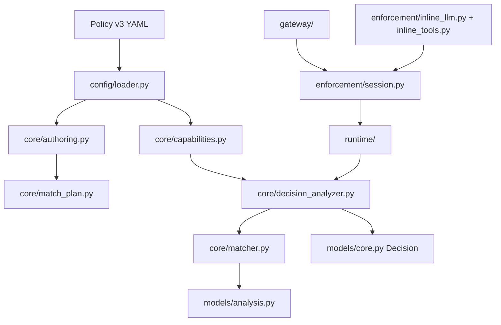

# 架构图与代码阅读地图

## 1. 生产依赖图

不存在生产 Python Rule、Rule Registry、Structured RulePlan、mandatory anchor 或 Safe Profile 兼容
编译路径。

## 2. 推荐阅读顺序

1. [`models/core.py`](../src/agent_guardrail/models/core.py)：Canonical Event、Relation、PendingTrace、
   Violation 与 Decision。
2. [`models/analysis.py`](../src/agent_guardrail/models/analysis.py)：Finding identity、位置、evidence、
   AnalysisError 和 AnalysisReport。
3. [`core/match_plan.py`](../src/agent_guardrail/core/match_plan.py)：anchor-free IR、静态引用校验和预算账本。
4. [`core/authoring.py`](../src/agent_guardrail/core/authoring.py)：可读 YAML/Python 作者模型到 MatchPlan。
5. [`core/registry.py`](../src/agent_guardrail/core/registry.py)：Predicate/Detector descriptor Registry。
6. [`core/capabilities.py`](../src/agent_guardrail/core/capabilities.py)：激活前 capability linking。
7. [`core/matcher.py`](../src/agent_guardrail/core/matcher.py)：whole-snapshot 确定性枚举和错误模型。
8. [`core/decision_analyzer.py`](../src/agent_guardrail/core/decision_analyzer.py)：Finding/Error → Decision。
9. [`config/loader.py`](../src/agent_guardrail/config/loader.py)：唯一生产 v3 Policy Loader。
10. [`runtime/runtime.py`](../src/agent_guardrail/runtime/runtime.py)：生命周期门面。
11. [`enforcement/session.py`](../src/agent_guardrail/enforcement/session.py)：pending 原子提交与 block 语义。
12. [`enforcement/input_normalizer.py`](../src/agent_guardrail/enforcement/input_normalizer.py)：独立事件展开。
13. [`enforcement/provenance.py`](../src/agent_guardrail/enforcement/provenance.py)：可信精确对应关系。
14. [`gateway/app.py`](../src/agent_guardrail/gateway/app.py)：OpenAI 路由、请求顺序和 Runtime 注入。
15. [`gateway/mcp.py`](../src/agent_guardrail/gateway/mcp.py)：MCP 2026 无状态路由。

## 3. 关键文件状态

| 文件 | 职责 | 状态 |
| --- | --- | --- |
| `core/policy.py` | v3 Schema、Enforcement action/failure config、CompiledPolicy | 生产 |
| `config/loader.py` | strict YAML → compiled/capability-linked Policy | 生产 |
| `config/match_loader.py` | 独立纯分析 AuthorPolicy → MatchPlan | SDK |
| `core/match_plan.py` | 唯一可执行 Rule IR 与成本账本 | 生产/SDK |
| `core/matcher.py` | snapshot/pending AnalysisReport | 生产/SDK |
| `core/monitor.py` | committed Finding identity 去重 | SDK；未持久化 |
| `core/decision_analyzer.py` | PolicyAnalyzer 和 Decision 聚合 | 生产 |
| `core/registry.py` | 可信 Predicate/Detector | 生产/SDK |
| `enforcement/session.py` | 请求/任务级 Trace、原子提交和 Audit | 生产 |
| `gateway/app.py` | OpenAI Gateway 与直接 evaluate | 生产 |
| `gateway/mcp.py` | MCP `2026-07-28` | 生产 |

## 4. 测试地图

- `test_match_plan.py`：Schema、引用和成本；
- `test_match_authoring.py`：可读 YAML 与编译期 predicate；
- `test_matcher.py`：typed/multi binding、derive、量词、关系、range、pending；
- `test_match_capabilities.py`：Predicate/Detector descriptor、timeout、cache 和 evidence；
- `test_analysis_models.py`：Finding/Report 不变量；
- `test_policy_loader.py`：v3 strict loading 与旧版本拒绝；
- `test_decision_analyzer.py`：Finding/Error/action/max_violations 投影；
- `test_session.py`：batch 原子性、关系、block 和异常；
- `test_gateway.py`：OpenAI 端到端与副作用顺序；
- `test_mcp_gateway.py` / `test_mcp_gateway_sdk.py`：MCP 端到端；
- `test_guarded_llm.py` / `test_guarded_tools.py` / `test_simulated_agent.py`：Inline 端到端；
- `test_invariant_compatibility_corpus.py`：I01–I14 能力 oracle。

## 5. 调试路径

Policy 加载失败：`config/loader.py → core/policy.py → core/authoring.py → core/capabilities.py`。

意外 allow/block：`core/matcher.py AnalysisReport → core/decision_analyzer.py Decision → session commit`。

关系未命中：先检查 `Event.relations`，再检查 `enforcement/provenance.py` 或 Gateway response relation；
不要根据 sequence 猜测来源。

副作用顺序错误：从 Gateway/Inline wrapper 的 pre Decision 开始，确认调用上游/工具发生在 allow 之后。
