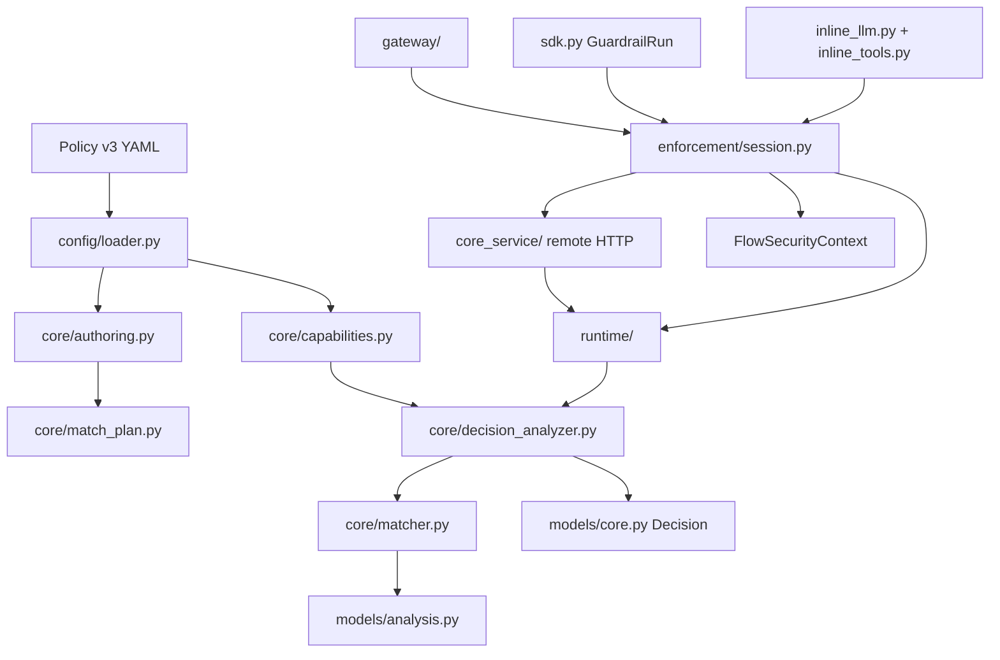

# 开发与代码阅读指南

> 适合谁：修改本仓库代码或进行安全 review 的开发者和 AI Agent。
> 解决什么：阅读路径、代码地图、测试要求、review 和质量门。
> 不包含什么：领域 Schema 的完整字段参考。

## 1. 开始任务

事实优先级依次是：用户当前要求、`AGENTS.md`、[当前架构合同](current-architecture-contract.md)、任务命中
的现行 ADR、专项设计、代码与测试。运行路由和配置以合同指定的代码源为准。

1. 阅读 `AGENTS.md`、当前合同和 ADR 索引。
2. 通过[文档导航](README.md)只打开任务相关领域文档。
3. capability 任务再读 `capability-status.yaml`。
4. 检查代码、测试和未提交修改，区分当前行为与规划。
5. 写清范围、不做事项和可验证退出条件。

## 2. 生产依赖图



## 3. 代码阅读顺序

| 任务 | 入口 |
| --- | --- |
| Event/Trace/Decision/security context | `models/core.py` |
| Finding/AnalysisReport | `models/analysis.py` |
| MatchPlan Schema 与预算 | `core/match_plan.py` |
| 作者模型与编译 | `core/authoring.py` |
| Registry/linking | `core/registry.py`、`core/capabilities.py` |
| 默认 capability | `config/defaults.py`、`predicates/`、`detectors/` |
| Matcher/Monitor | `core/matcher.py`、`core/monitor.py` |
| Finding/Error → Decision | `core/decision_analyzer.py` |
| v3 Policy Loader | `config/loader.py` |
| Session 与 normalization | `enforcement/session.py`、`input_normalizer.py` |
| 框架无关编程式接入 | `sdk.py` |
| OpenAI/MCP | `gateway/app.py`、`gateway/mcp.py`、`adapters/` |
| 远程 Core/双容器 | `core_service/`、`runtime/remote.py`、`compose.yaml`、`docker/` |

调试意外 allow/block：`Matcher Report → Decision Analyzer → Session commit`。关系未命中先看
`Event.relations` 和 Relation 建立点，不根据 sequence 猜来源。副作用顺序从 Gateway/Wrapper 的
`before_*_call` Decision 开始检查。

## 4. 实现边界

- Core 不依赖 FastAPI、Provider SDK 或具体 Agent Framework。
- Adapter 只转换协议；Enforcement 控制副作用；Runtime 只管理 Analyzer 生命周期。
- 公共模型和配置使用封闭、类型化 Schema。
- 使用显式依赖注入；时间、ID、HTTP Client 和 Tool Executor 可替换。
- 不使用 `eval`、`exec`、动态外部 import、pickle Policy 或未知异常→allow。
- 不记录完整 Secret、原始 PII、prompt 或 ToolResult。
- 新 capability 必须经过 descriptor、预算、timeout 和 evidence 合同；YAML 不获得实现权限。

## 5. 测试地图

- `test_match_plan.py`：IR、引用、Schema 和成本；
- `test_match_authoring.py`：作者 YAML/Python 与 predicate 内联；
- `test_matcher.py`：I01–I14 结构语义、whole-pending 和 Monitor；
- `test_match_capabilities.py`：linking、cache、timeout、预算和 evidence；
- `test_analysis_models.py`：Finding identity 与 Report；
- `test_models.py`：Event、Relation、PendingTrace 和安全上下文；
- `test_session.py`：batch 原子性、block、异常和可信来源；
- `test_sdk.py`：编程式 EventRef、显式关系和跨 run 防伪；
- `test_security_detectors.py` / `test_priority_detectors.py`：既有 Detector 算法边界；
- `test_secret_detector_parity.py` / `test_pii_detector.py` / `test_prompt_detector_parity.py`：
  Secret、PII、Prompt/模型适配边界；
- `test_code_detector_parity.py`：Python/IPython、hidden content、Semgrep 和 YARA 边界；
- `test_builtin_predicates.py` / `test_similarity_predicates.py`：基础与 fuzzy Predicate 边界；
- `test_similarity_detector.py`：Invariant `is_similar`、profile model、backend、timeout、脱敏和 Enforcement；
- `test_alignment_registries.py` / `test_invariant_detector_alignment.py`：默认/可选 Registry、
  MatchPlan→Decision→Enforcement 对齐路径；
- `test_documentation_contracts.py`：状态目录封闭词汇、Registry 名称覆盖和本地文档链接；
- `test_builtin_capabilities.py`：Registry→Decision→Enforcement 副作用；
- Gateway/Inline/MCP integration：真实接入顺序与上游调用计数。

## 6. 新行为测试要求

至少覆盖：安全输入、明确违规、不适用 Event/语境、缺失/畸形字段、相邻边界、预算/timeout/异常、失败动作、
脱敏、调用前 block 副作用为零和输出释放前 block 不释放结果。

Detector 算法有效性不能用 mock 证明；外部 backend fake 只能证明 adapter 合同。Gateway 测试使用
MockTransport/Fake Upstream，不访问真实模型 API。

## 7. Review 检查

- 副作用是否只发生在调用前 allow 后？
- block/error 是否保持 pending batch 原子性并绑定正确 Event ID？
- sequence 是否被错误当作 provenance？客户端是否能提升 origin/security fact？
- 新节点是否有静态类型、成本、失败代码、脱敏和相邻超限测试？
- capability 是否显式 linking，cache identity 是否绑定实现版本、输入和 Event 上下文？
- tentative pending 是否错误推进 Monitor dedupe？
- Detector fact 是否与 T01–T10 的可信 source/sink 语境组合？
- 文档是否把 planned、adapter_only、fake 或目标场景写成已交付？

## 8. 完成与提交

```bash
uv sync --frozen --extra gateway --dev
uv run pytest --cov=agent_guardrail --cov-report=term-missing
uv run ruff check .
uv run pyright
uv build
git diff --check
```

还要检查暂存文件和凭据泄漏，不提交环境文件、缓存、构建产物、Audit 或真实 Secret。

新增 Action、改变 Policy/MatchPlan 链、Canonical Event/Relation、pre/post 承诺、持久状态、远程 Core、
新信任主体、原始敏感内容保留、payload Transformation 或破坏性协议升级时，先按
[ADR 路由](adr/README.md)记录决策。
