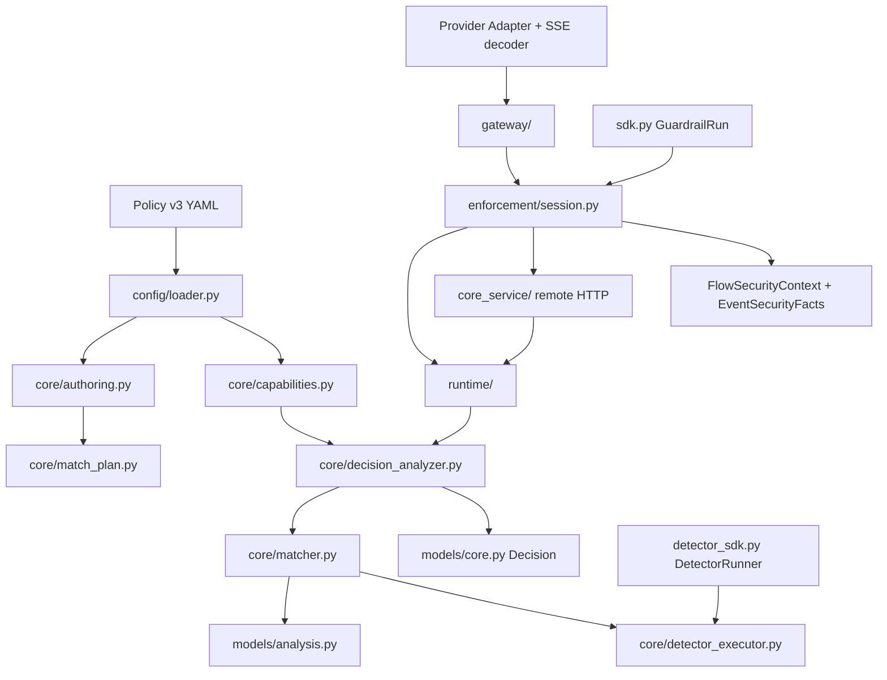

# 开发与代码阅读指南

> 本文说明如何阅读本仓库的代码、选择测试、进行安全 review，以及在提交修改前完成检查。
> 相关参考：[文档导航](README.md)、[当前架构合同](current-architecture-contract.md)。

## 1. 开始任务

事实优先级依次是：用户当前要求、`AGENTS.md`、[当前架构合同](current-architecture-contract.md)、专项设计、代码与测试。运行路由和配置以合同指定的代码源为准；Git 历史用于追溯变更。

1. 阅读 `AGENTS.md` 和当前合同。
2. 通过[文档导航](README.md)只打开任务相关领域文档。
3. capability 任务再读 `capability-status.yaml`。
4. 检查代码、测试和未提交修改，区分当前行为与规划。
5. 写清范围、不做事项和可验证退出条件。

## 2. 生产代码关系

下面的关系图展示一条请求从规则文件、分析器到 Gateway 和应用接入层的主要路径；箭头表示代码调用或数据提交方向。



## 3. 按问题查找代码

| 任务 | 入口 |
| --- | --- |
| Event/Trace/Decision/security facts/context | `models/core.py` |
| Finding/AnalysisReport | `models/analysis.py` |
| MatchPlan Schema 与预算 | `core/match_plan.py` |
| 作者模型与编译 | `core/authoring.py` |
| Registry/linking | `core/registry.py`、`core/capabilities.py` |
| 共享 Detector 执行边界 | `core/detector_executor.py` |
| 默认 capability | `config/defaults.py`、`predicates/`、`detectors/` |
| Matcher | `core/matcher.py` |
| Finding/Error → Decision | `core/decision_analyzer.py` |
| v3 Policy Loader | `config/loader.py` |
| Session、tentative stream inspection 与 normalization | `enforcement/session.py`、`input_normalizer.py` |
| 框架无关编程式接入 | `sdk.py` |
| 无 YAML 直接 Detector 接入 | `detector_sdk.py` |
| Provider/Streaming/MCP | `gateway/app.py`、`gateway/upstream.py`、`gateway/mcp.py`、`adapters/` |
| 远程 Core/双容器 | `core_service/`、`runtime/remote.py`、`compose.yaml`、`docker/` |

调试意外 allow/block：`Matcher Report → Decision Analyzer → Session commit`。关系未命中先看 `Event.relations` 和 Relation 建立点，不根据 sequence 猜来源。Gateway 路径从 `before_*_call` Decision 检查副作用顺序；SDK 路径检查应用是否在 `Decision.blocked` 时停止操作。

## 4. 实现边界

- Core 不依赖 FastAPI、Provider SDK 或具体 Agent Framework。
- Adapter 只转换协议；Enforcement 控制副作用；Runtime 只管理 Analyzer 生命周期。
- 公共模型和配置使用封闭、类型化 Schema。
- 使用显式依赖注入；时间、ID、HTTP Client 和 Tool Executor 可替换。
- 不使用 `eval`、`exec`、动态外部 import、pickle Policy 或未知异常→allow。
- 不记录完整 Secret、原始 PII、prompt 或 ToolResult。
- 新 capability 必须经过 descriptor、预算、timeout 和 evidence 合同；YAML 不获得实现权限。

## 5. 测试目录

测试文件名和代码标识保留英文，因为它们可以直接用于定位源码；下面的说明只解释每组测试验证的行为。

- `test_match_plan.py`：IR、引用、Schema 和成本；
- `test_match_authoring.py`：作者 YAML/Python 与 predicate 内联；
- `test_matcher.py`：I01–I14 结构语义、完整待提交批次和事件快照求值；
- `test_match_capabilities.py`：linking、cache、timeout、预算和 evidence；
- `test_analysis_models.py`：Finding identity 与 Report；
- `test_models.py`：Event、Relation、PendingTrace 和安全上下文；
- `test_session.py`：batch 原子性、block、异常和可信来源；
- `test_sdk.py`：编程式 EventRef、显式关系和跨 run 防伪；
- `test_detector_sdk.py`：直接 Detector 的枚举、text/JSON/batch、timeout、失败与脱敏；
- `test_openai_stream_adapter.py` / `test_responses_adapter.py` / `test_streaming_adapter.py`：Chat 与 Responses canonical 映射、SSE 状态机、限制与失败；
- `test_model_upstream.py`：固定上游 URL、鉴权、限长、timeout/transport 和 SSE Content-Type；
- `test_security_detectors.py` / `test_priority_detectors.py`：既有 Detector 算法边界；
- `test_secret_detector_parity.py` / `test_pii_detector.py` / `test_prompt_detector_parity.py`：Secret、PII、Prompt/模型适配边界；
- `test_code_detector_parity.py`：Python/IPython、hidden content、Semgrep 和 YARA 边界；
- `test_real_detector_backends.py`：本地真实检测后端（Presidio、Semgrep、YARA、Prompt 模型）与部署配置/组件组合的装配边界；
- `test_llm_judge_detector.py`：`prompt_injection_judge` 的评审配置、threshold、descriptor 与脱敏；
- `test_builtin_predicates.py` / `test_similarity_predicates.py`：基础与 fuzzy Predicate 边界；
- `test_similarity_detector.py`：Invariant `is_similar`、配置中的模型、检测后端、timeout、脱敏和 Enforcement；
- `test_alignment_registries.py` / `test_invariant_detector_alignment.py`：默认/可选 Registry、MatchPlan→Decision→Enforcement 对齐路径；
- `test_builtin_capabilities.py`：Registry→Decision→Enforcement 副作用；
- Gateway 和 MCP 集成测试：真实接入顺序、Chat/Responses 流式窗口与上游调用计数；
- `test_external_agent_base_url.py` / `test_remote_core_gateway.py`：官方 OpenAI SDK、真实 HTTP 首块释放/取消，以及 remote Core streaming 链路。

## 6. 新行为的测试要求

至少覆盖：安全输入、明确违规、不适用 Event/语境、缺失/畸形字段、相邻边界、预算/timeout/异常、失败动作、脱敏、调用前 block 副作用为零和输出释放前 block 不释放结果。

检测算法的有效性需要真实算法或独立评估，不能用 mock 证明；外部后端的模拟实现只能证明适配器接口符合约定。Gateway 测试使用 `MockTransport` 返回预设的上游响应，不访问真实模型 API。

## 7. Review 检查项

- 副作用是否只发生在调用前 allow 后？
- block/error 是否保持 pending batch 原子性并绑定正确 Event ID？
- sequence 是否被错误当作 provenance？客户端是否能提升 origin/security fact？
- 新节点是否有静态类型、成本、失败代码、脱敏和相邻超限测试？
- capability 是否显式 linking，cache identity 是否绑定实现版本、输入和 Event 上下文？
- tentative pending 是否错误推进 Finding 去重？
- Streaming event 是否全部进入 Canonical 累计输出？当前未通过窗口是否可能提前释放？
- 流式文档是否明确承认已释放窗口不能撤回，而没有冒充非流式原子保证？
- Detector fact 是否与 T01–T10 的可信 source/sink 语境组合？
- 文档是否把 planned、adapter_only、fake 或目标场景写成已交付？
- 文档是否把未来决策写成了既定结论，或在状态/评测叙述里混入未附数据的比较性断言？

## 8. 完成检查与提交

```bash
uv sync --frozen --extra gateway --dev
uv run pytest --cov=agent_guardrail --cov-report=term-missing
uv run ruff check .
uv run pyright
uv build
git diff --check
```

还要检查暂存文件和凭据泄漏，不提交环境文件、缓存、构建产物、Audit 或真实 Secret。

新增 Action、改变 Policy/MatchPlan 链、Canonical Event/Relation、pre/post 承诺、持久状态、远程 Core、新信任边界、原始敏感内容保留、payload Transformation 或破坏性协议升级时，必须在同一变更中更新当前架构合同、专项设计和安全测试。需要先讨论时可创建临时 `docs/proposals/<topic>.md`；结论接受并合并后删除，历史由 Git 保存。
